# Math Presentation Images

Good source for copyright-free icons: https://commons.wikimedia.org/

| Image | Credit/Source |
|:---:|:---:|
| [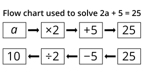](equations_flowchart.svg) | https://www.dcp.edu.gov.on.ca/en/curriculum/elementary-mathematics/glossary |
| [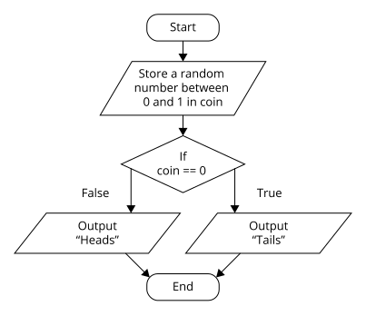](flowchart_coding.svg) | https://www.dcp.edu.gov.on.ca/en/curriculum/elementary-mathematics/glossary |
| [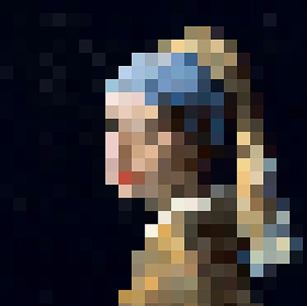](Girl_with_a_Pearl_Earring_(pixelated).jpg) | https://commons.wikimedia.org/wiki/File:Girl_with_a_Pearl_Earring_(pixelated).jpg |
|  | https://commons.wikimedia.org/wiki/File:IPO.png |
| [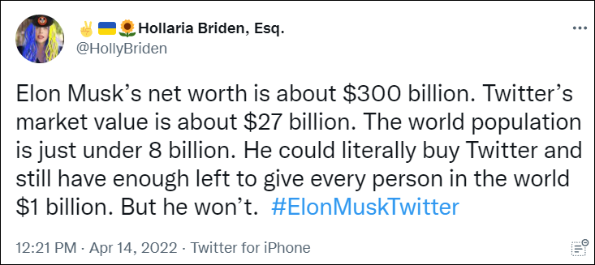](Math-is-hard.png) | https://twitter.com/HollyBriden/status/1514640013618647041 |
| [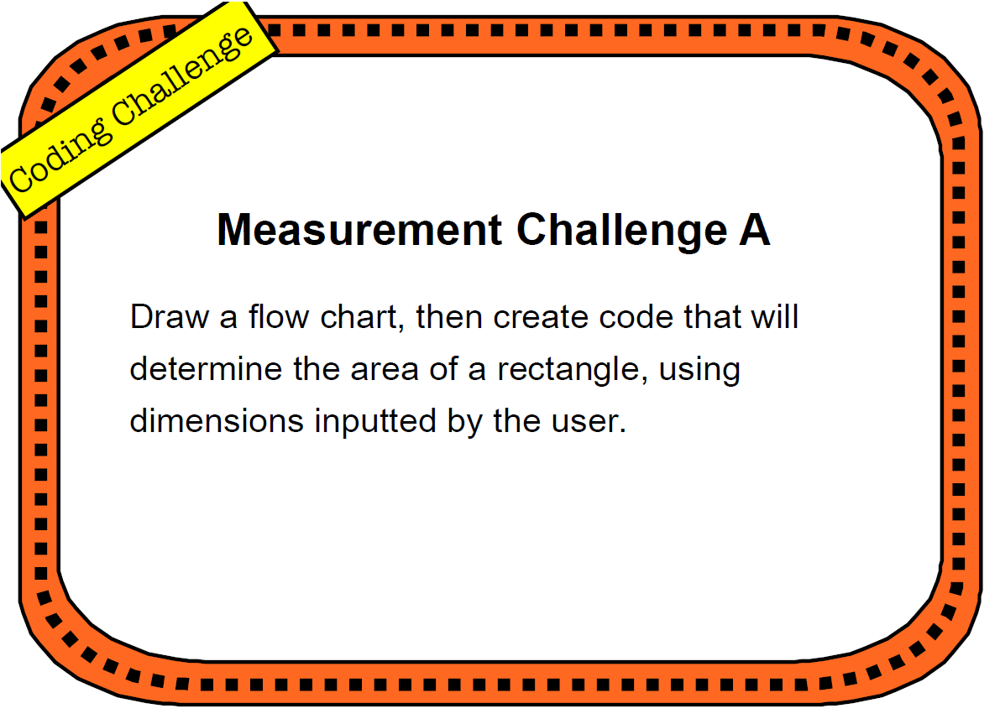](Measurement-challenge-A.png) | Unknown |
| [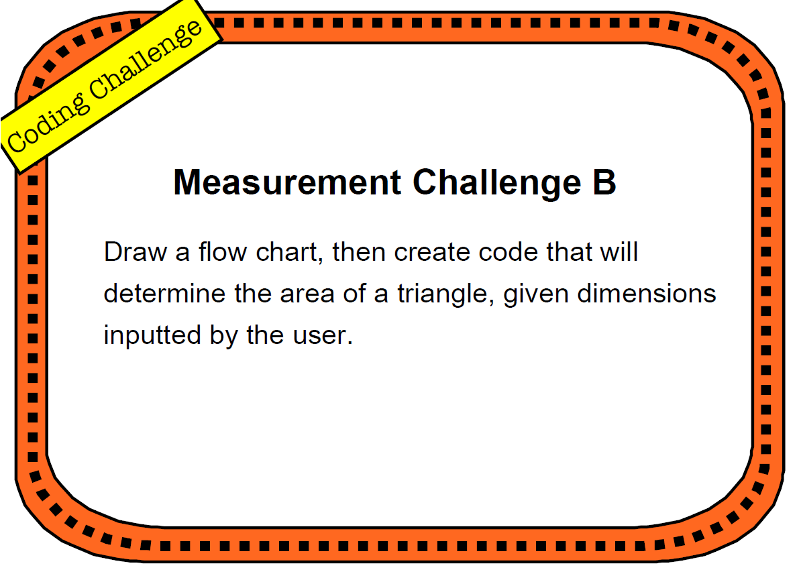](Measurement-challenge-B.png) | Unknown |
| [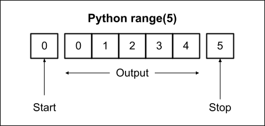](Python-Range(5).png) | https://docs.google.com/drawings/d/1z-1FFqJutqxRZ8rr5kxyBXtjbOSHUSBPxSZkEKJp7A0/edit?usp=sharing |
| [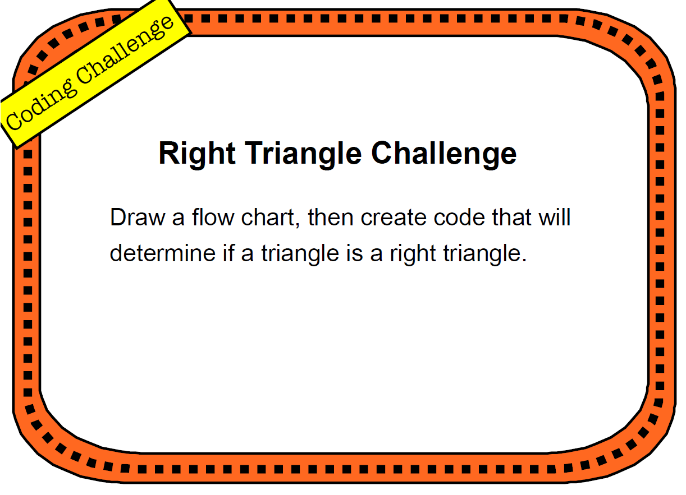](right-triangle-challenge.png) | Unknown |
| [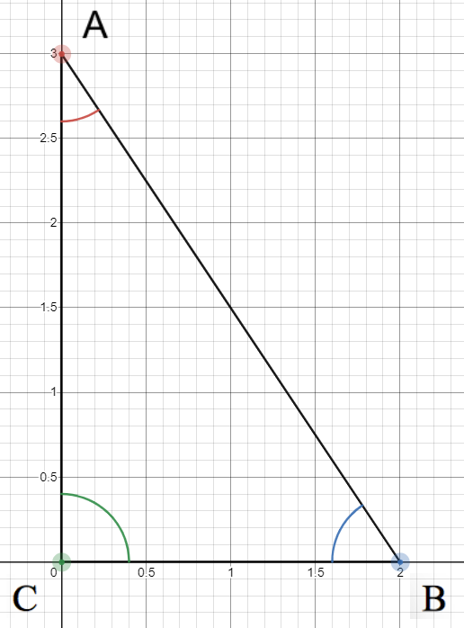](right-triangle.png) | <https://www.desmos.com/calculator/imetqilrmn> |
| [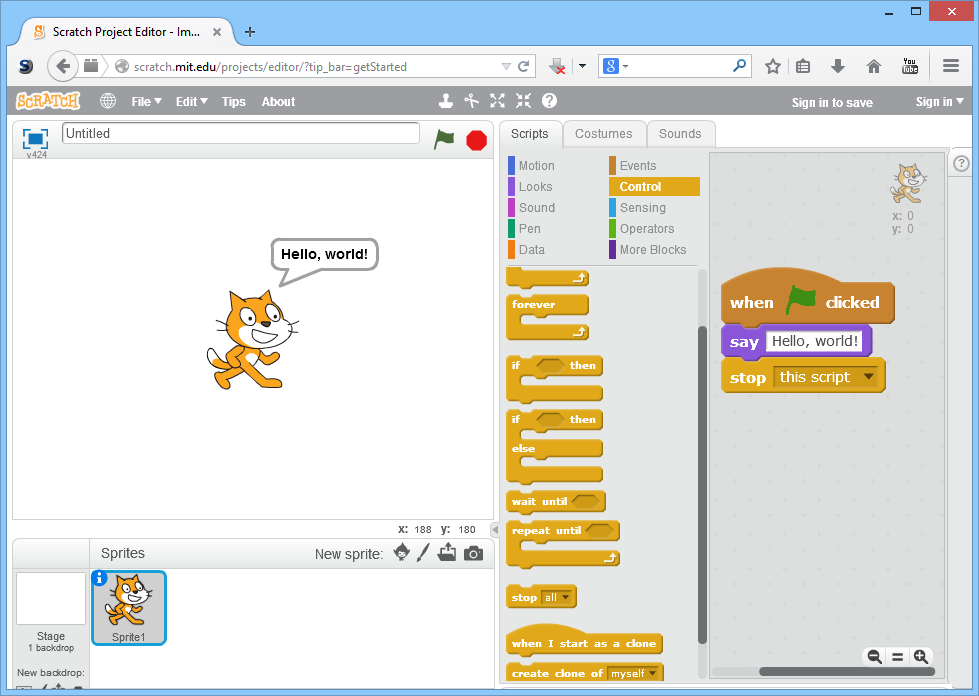](Scratch_2.0_Screen_Hello_World.png) | https://commons.wikimedia.org/wiki/File:Scratch_2.0_Screen_Hello_World.png |
|  | Screenshot |
| [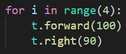](turtle-square-2.png) | Screenshot |

## Markdown Usage

To use these images in Markdown, use the following format:

``

Replace the path as necessary.
