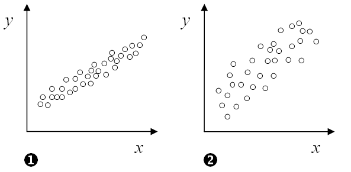
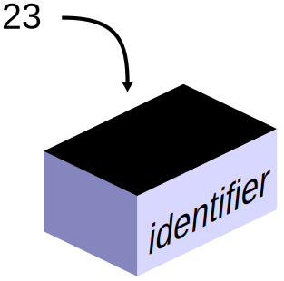
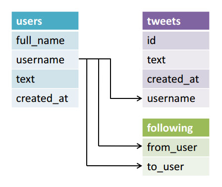
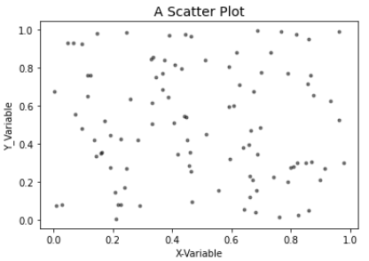

# README.md

| Image | URL |
|:---:|:---:|
| | https://fonts.google.com/noto/specimen/Noto+Sans+Mayan+Numerals |
|  | https://data-challenge.lighthouselabs.ca/challenge/18 |
|  | https://commons.wikimedia.org/wiki/File:CPT-programming-variable.svg |
|  | https://cdn.tutsplus.com/net/authors/lalith-polepeddi/relational-databases-for-dummies-fig4.png |
|  | https://data-challenge.lighthouselabs.ca/challenge/18 |